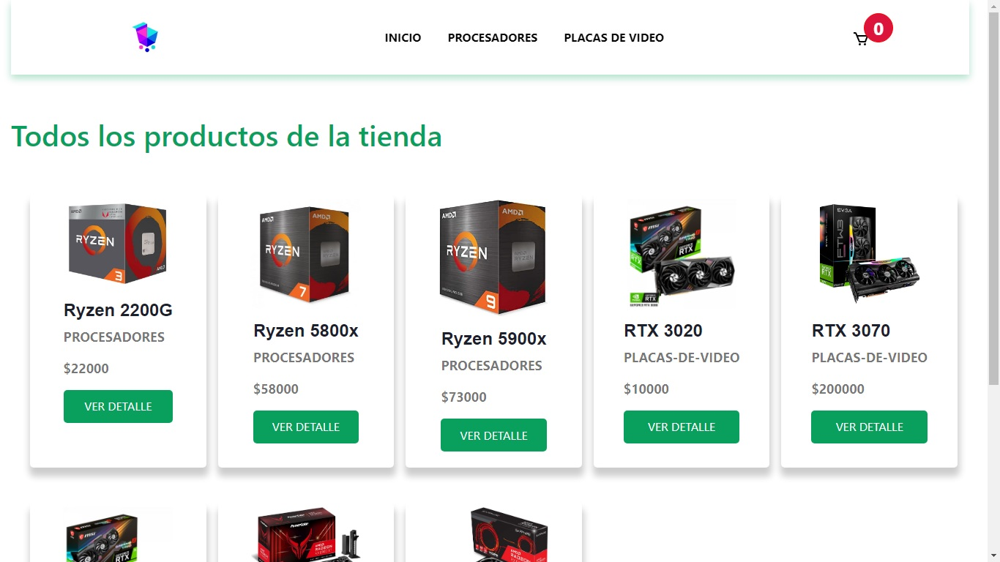
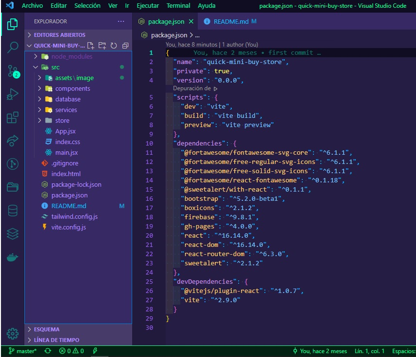

# Quickmini Buystore
_Bienvenido, yo soy **Ezequiel**, y en este repositorio podras encontrar mi primera tienda e-commerce, desarrollada con [ReactJS](https://es.reactjs.org/)._



## Informacion General

En este repositorio se encuentra **mi proyecto final** del curso de React en CoderHouse. Esta es mi primera tienda e-commerce y la misma esta desarrollada con [ReactJS](https://es.reactjs.org/).

### Coder House

Para mas informacion sobre **Coder House** podes dirijirte a su sitio oficial: [www.coderhouse.com](https://www.coderhouse.com/).


## Comencemos 🚀

En esta seccion tendras una serie de instrucciones que te permitirán obtener una copia del proyecto en funcionamiento en tu máquina local, para propósitos de desarrollo y pruebas.

### Pre-requisitos 📋

Existen muchas formas de crear una app en React, incluso podes crear tu propio ambiente de desarrollo con herramientes como Babel, Parcel, Webpack.

Pero tambien existe una gran cantidad de herramientes ya disponibles para crear aplicaciones en React.

### NodeJS y NPM

Lo primero que necesitaremos es instalar NodeJS.
Te dejo el link oficial para descargar NodeJS segun tu sistema operativo, [NodeJS](https://nodejs.org/en/).

Como recomendacion, instala la version LTS. El instalador te va a guiar con el paso a paso para instalar NodeJS en tu maquina.

Despues de la instalacion, abre la terminal y ejecuta el siguiente comando:

```
node -v
npm -v
```

Esto te confirmara que instalaste correctamente NodeJS y NPM exitosamente.

### Vite

Vite es una herramienta de tooling para el Frontend. Lo podes agrupar en la categoría donde se encuentrar otros como Webpack, Parcel y Snowpack. Es muy útil para crear una estructura de proyecto que se pueda utilizar con React y de una forma muy rápida, ya que no necesitas tener que configurar nada y aprovecha el sistema de módulos de ES6 (ESModules) por lo que puede ser servido dinamicamente según lo necesite el navegador.

Yo eleji Vite para crear mi proyecto. Por eso te dejo este link con mas informacion [Vite: Getting Started](https://vitejs.dev/guide/) y los comandos para instalarlo:

```
npm init vite@latest
npm run dev
```

Aun que claro, como opcion tambien podes usar Create React App:

```
npx create-react-app my-app
cd my-app
npm start
```

Te dejo mas info aca: [Create React App.](https://create-react-app.dev/docs/getting-started/)

## Instalación 🔧

A continuacion te dejo las diferentes maneras que tenes para descarga el proyecto, y que puedas ejecutarlo y tener un entorno de desarrollo y lo pruebes.

#### Descargando el proyecto
Te muestro las formas de descargar el proyecto desacargondo el Zip o clonando el repositorio.

#### Instalación Zip

Pueden descargar el repositorio en formato zip.

1. Ir a Code
2. Dowload Zip
3. Descomprimir el archivo
4. Ingresando en la carpeta del proyecto, ejecuta en una terminal:

```
npm install
```
Para abrir el proyecto de manera local en el browser:

```
npm start
```

#### Instalación Git Glone

Otra manera de acceder al proyecto es clonarlo, ejecutando en la consola:

```
git clone https://github.com/Ezequiel-Barrera/myapp.git
```

## Despliegue 📦

Una vez clonado el proyecto, lo desplegamos dela siguiente manera:

```
npm install
npm run dev
```

#### Estructura del Proyecto

Una vez instalado el proyecto, el mismo deveria tener la siguiente estructura:




## Demo ⚙️

Aqui dejo una pequeña Demo, de como seria el funcionamiento del proyecto, simulando un caso de compra como la aplicacion.


## Construido con 🛠️

Tecnologías utilizadas en el proyecto son:

#### Lenguajes

- [HTML](https://developer.mozilla.org/es/docs/Web/HTML) _Estructura_
- [CSS](https://developer.mozilla.org/es/docs/Web/CSS) _Estilos_
- [JAVASCRIPT](https://developer.mozilla.org/es/docs/Web/JavaScript) _Logica_

#### Librerias
- [ReactJS](https://es.reactjs.org/) _Interfaz_

#### Servicios
- [Firebase](https://firebase.google.com/) _Base de datos_

#### Dependencias
- [Fort Awesome](https://fortawesome.com/) - _Fuentes_
- [Fort Awesome/Icons](https://fontawesome.com/icons?d=gallery) - _Iconos_
- [SweetAlert](https://sweetalert.js.org/guides/) _Alertas_
- [Bootstrap](https://getbootstrap.com/) _Estilos_
- [Boxicons](https://boxicons.com/) _Iconos_

## Autor ✒️

Para saber mas de mi, dejo mi Linkedin que cuenta mi formacion y actualidad.

***Ezequiel Andrés Barrera*** - web developer - [Linkedin](https://www.linkedin.com/in/ezequiel-javascript/)

También puedes mirar todos los repositorios en lo que trabaje, y esta publicados en mi [Github](https://github.com/Ezequiel-Barrera).

## Expresiones de Gratitud 🎁


* Desde ya, quisiera agradecer a mi profesor de cursada. [Diego Medina](https://www.linkedin.com/in/diego-medina/) 📢
* Invita una cerveza 🍺 o un café ☕ a mi tutor [Santiago Salkin](https://www.linkedin.com/in/santiago-salkin-a2a5a689/)
* Da las gracias públicamente 🤓 a todos los comañeros de CoderHouse que tambien siento que son parte


---
⌨️ [Ezequiel Barrera](https://www.linkedin.com/in/ezequiel-javascript/) 😊